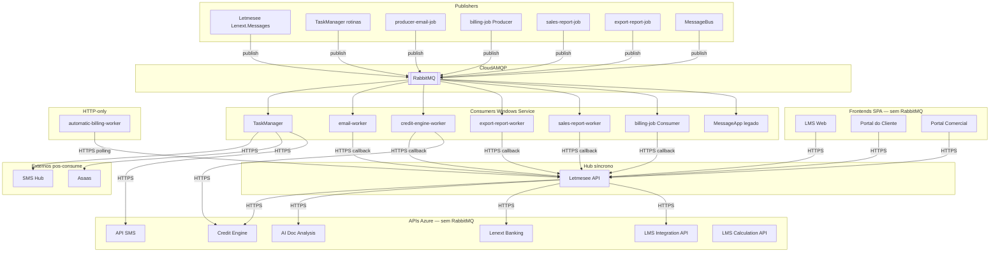
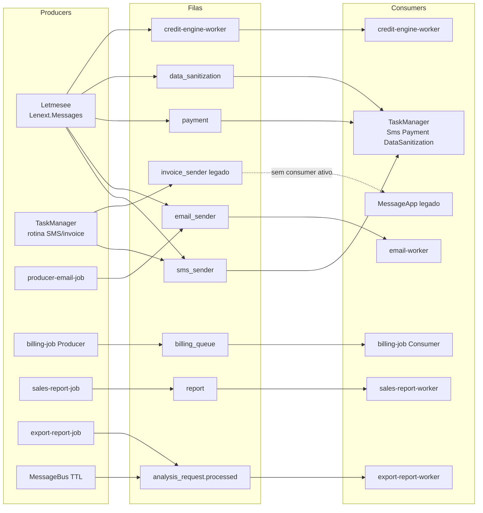
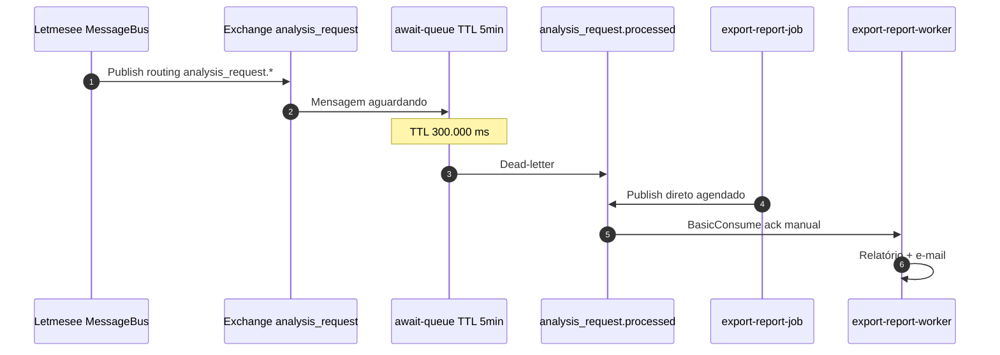
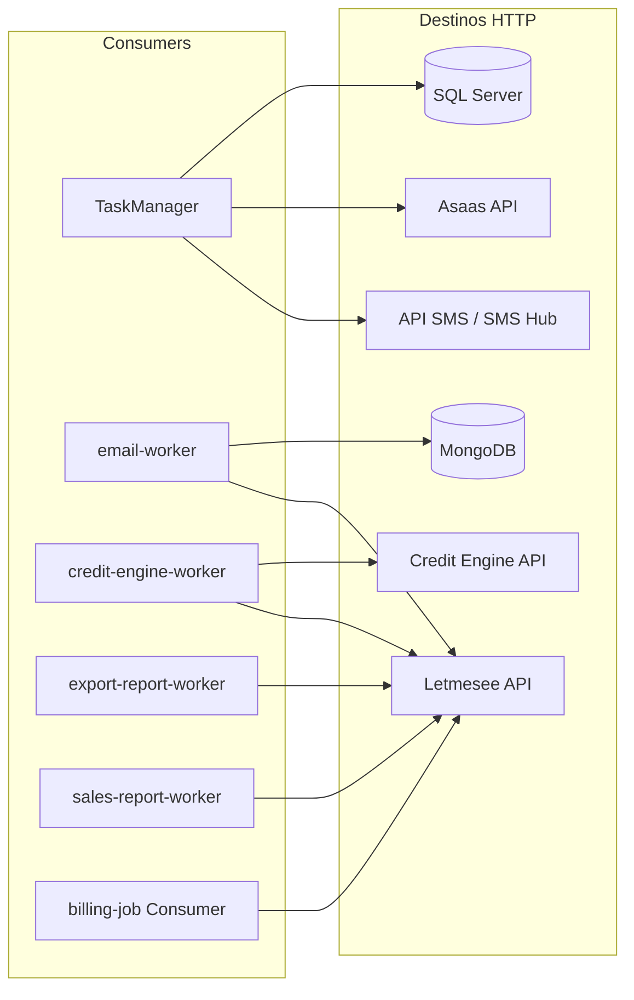

# Mapa Mensageria Lenext

Visão completa da mensageria do ecossistema Lenext: **todos os projetos**, filas [[RabbitMQ]], producers, consumers e callbacks HTTP pós-processamento.

> **Broker:** CloudAMQP (`moose.rmq.cloudamqp.com`) · **Biblioteca:** `RabbitMQ.Client` (sem MassTransit) · **Producers centrais:** `Lenext.Messages` em [[Letmesee]]

---

## Inventário de projetos

Rastreamento validado no código-fonte (`RabbitMQ.Client`, `BasicPublish`, `BasicConsume`, `QueueDeclare`).

### Com RabbitMQ

| Projeto | Repositório | Papel | Filas / exchange |
|---------|-------------|-------|------------------|
| [[Letmesee]] | `Letmesee` | **Producer** (+ `MessageBus`) | `sms_sender`, `email_sender`, `payment`, `data_sanitization`, `credit-engine-worker`, exchange `analysis_request` |
| [[TaskManager]] | `task-manager` | **Consumer** + **Producer** | Consome: `sms_sender`, `payment`, `data_sanitization` · Publica: `sms_sender`, `email_sender`, `invoice_sender`† |
| [Producer Email Job](services/letmesee-producer-email-task-job/Producer%20Email%20Job.md) | `02-jobs/letmesee-producer-email-task-job` | **Producer** | `email_sender` |
| [Billing Subscriptions Job](services/lms-billing-subscriptions-job/Billing%20Subscriptions%20Job.md) | `02-jobs/lms-billing-subscriptions-job` | **Producer** + **Consumer** | `billing_queue` |
| [Sales Report Job](services/letmesee-sales-report-job/Sales%20Report%20Job.md) | `02-jobs/letmesee-sales-report-job` | **Producer** | `report` |
| [Export Report Job](services/letmesee-export-report-analysis-request-worker/Export%20Report%20Job.md) | `03-workers/letmesee-export-report-analysis-request-worker` | **Producer** | `analysis_request.processed` |
| [Email Worker](services/letmesee-sender-email-worker/Email%20Worker.md) | `03-workers/letmesee-sender-email-worker` | **Consumer** (+ republish) | `email_sender` |
| [Credit Engine Worker](services/lms-credit-engine-worker/Credit%20Engine%20Worker.md) | `03-workers/lms-credit-engine-worker` | **Consumer** | `credit-engine-worker` |
| [Export Report Worker](services/letmesee-export-report-analysis-request-worker/Export%20Report%20Worker.md) | `03-workers/letmesee-export-report-analysis-request-worker` | **Consumer** | `analysis_request.processed` |
| [Sales Report Worker](services/letmesee-sales-report-worker/Sales%20Report%20Worker.md) | `03-workers/letmesee-sales-report-worker` | **Consumer** | `report` |
| [MessageApp](services/message-app/MessageApp.md) | `MessageApp` | **Consumer** (legado) | `data_sanitization`‡ |

† `invoice_sender` — fila legada; [[TaskManager]] ainda publica via `PublishSubscriptionsBillings`, fluxo migrado para `billing_queue`.  
‡ MessageApp consome a fila configurada em `RabbitMQSettings:Queue` (`data_sanitization`); `QueueInvoice` existe na config mas não é usada pelo consumer ativo.

### Sem RabbitMQ

| Projeto | Repositório | Integração |
|---------|-------------|------------|
| [LMS Web](services/lms-web-lovable/LMS%20Web.md) | `04-web/lms-web-lovable` | HTTPS → [[Letmesee]] |
| [Portal do Cliente](services/lms-web-client-portal/Portal%20do%20Cliente.md) | `04-web/lms-web-client-portal` | HTTPS → [[Letmesee]] |
| [Portal Comercial](services/lms-web-vendor-portal/Portal%20Comercial.md) | `04-web/lms-web-vendor-portal` | HTTPS → [[Letmesee]] |
| [[Motor de Crédito]] | `01-apis/credit-engine` | HTTPS ← Letmesee / credit-engine-worker |
| [AI Doc Analysis API](services/letmesee-ai-doc-analysis-api/AI%20Doc%20Analysis%20API.md) | `01-apis/letmesee-ai-doc-analysis-api` | HTTPS ← [[Letmesee]] |
| [Lenext Banking Service](services/lenext-banking/Lenext%20Banking%20Service.md) | `01-apis/boleto-net-core` | HTTPS ← [[Letmesee]] |
| [LMS Integration API](services/lms-integration-api/LMS%20Integration%20API.md) | `01-apis/lms-integration-api` | HTTPS ← [[Letmesee]] |
| [API SMS](services/api-sms/API%20SMS.md) | `01-apis/api-sms` | HTTPS ← [[TaskManager]] |
| LMS Calculation API | `01-apis/lms-calculation-api` | HTTPS (sem mensageria) |
| [Automatic Billing Worker](services/letmesee-automatic-billing-queue-worker/Automatic%20Billing%20Worker.md) | `03-workers/letmesee-automatic-billing-queue-worker` | **HTTP-only** — polling API [[Letmesee]] |

---

## Camada 1 — Ecossistema completo

Todos os deployáveis e o broker central.

---

## Camada 2 — Producers → Filas → Consumers

---

## Detalhamento das filas

Para que serve cada fila no ecossistema — propósito de negócio, gatilho e resultado do processamento.

### `sms_sender`

**Propósito:** disparo assíncrono de SMS em massa para cobrança e notificações de inadimplência.

| Aspecto | Detalhe |
|---------|---------|
| **Domínio** | [[Defaulting Collections]], [[Task Manager]] |
| **Gatilho** | Rotina automática do [[TaskManager]] (a cada ~20 min) ou envio manual pelo LMS ([[Letmesee]]) |
| **Payload** | `TaskMessageDTO` — `TaskId`, regra de notificação, grupo de usuário |
| **Resultado** | [[TaskManager]] consulta faturas elegíveis → envia via API SMS / SMS Hub → atualiza status da tarefa no SQL |

### `email_sender`

**Propósito:** envio assíncrono de e-mails de cobrança, notificações e comunicações transacionais.

| Aspecto | Detalhe |
|---------|---------|
| **Domínio** | [[Defaulting Collections]], comunicação com cliente |
| **Gatilho** | Disparo pelo LMS, job [producer-email-job](services/letmesee-producer-email-task-job/Producer%20Email%20Job.md) ou republicação do [email-worker](services/letmesee-sender-email-worker/Email%20Worker.md) em retry |
| **Payload** | `TaskMessageDTO` com dados da tarefa/regra de e-mail |
| **Resultado** | [email-worker](services/letmesee-sender-email-worker/Email%20Worker.md) chama API [[Letmesee]] para envio SMTP; falhas persistidas em MongoDB (`EmailSendRetries`) |

### `payment`

**Propósito:** processar confirmações de pagamento recebidas via webhook [[Asaas]] de forma assíncrona, sem bloquear a API.

| Aspecto | Detalhe |
|---------|---------|
| **Domínio** | [[Banking]], [[ERP Billing]] |
| **Gatilho** | [[Letmesee]] publica após receber webhook de pagamento confirmado do Asaas |
| **Payload** | Referência externa da fatura, dados do pagamento |
| **Resultado** | [[TaskManager]] identifica fatura → baixa título → renova assinatura / credita produtos → registra log |

### `data_sanitization`

**Propósito:** higienização de base de contatos — enriquecer planilhas de CPF/CNPJ com dados de localização (Assertiva).

| Aspecto | Detalhe |
|---------|---------|
| **Domínio** | [[Localization]] |
| **Gatilho** | Usuário faz upload de planilha Excel no LMS ([[Letmesee]]) |
| **Payload** | `UsuarioMessageDTO` com referência ao arquivo importado |
| **Resultado** | [[TaskManager]] processa linha a linha → consulta API de localização → gera Excel enriquecido para download |

### `credit-engine-worker`

**Propósito:** executar consultas pesadas do [[Motor de Crédito]] (bureaus, score, relatórios) fora da requisição HTTP síncrona.

| Aspecto | Detalhe |
|---------|---------|
| **Domínio** | [[Credit Analytics]], [[Análise de Crédito]] |
| **Gatilho** | Solicitação de análise de crédito no LMS que exige processamento assíncrono |
| **Payload** | `QueueMessage` com parâmetros da consulta (CPF/CNPJ, produto, empresa) |
| **Resultado** | [credit-engine-worker](services/lms-credit-engine-worker/Credit%20Engine%20Worker.md) chama [[Motor de Crédito]] → atualiza status na API [[Letmesee]] |

### `analysis_request` (exchange topic)

**Propósito:** exchange de roteamento para o ciclo de vida de solicitações de análise de crédito — não é fila de consumo direto.

| Aspecto | Detalhe |
|---------|---------|
| **Domínio** | [[Análise de Crédito]], [[Credit Analytics]] |
| **Gatilho** | Eventos `BaseEvent` publicados pelo `MessageBus` em [[Letmesee]] com routing `analysis_request.*` |
| **Mecanismo** | Topic exchange → `await-queue` (TTL 5 min) → dead-letter → `analysis_request.processed` |
| **Motivo do TTL** | Aguardar conclusão de etapas síncronas antes de disparar exportação do relatório |

### `analysis_request.processed`

**Propósito:** sinalizar que uma análise de crédito foi concluída e disparar a geração e envio do relatório ao solicitante.

| Aspecto | Detalhe |
|---------|---------|
| **Domínio** | [[Análise de Crédito]], [[Credit Analytics]] |
| **Gatilho** | Dead-letter do `MessageBus` (após TTL) ou job agendado [export-report-job](services/letmesee-export-report-analysis-request-worker/Export%20Report%20Job.md) |
| **Payload** | Corpo do evento de análise (`EventBody`) com IDs da solicitação |
| **Resultado** | [export-report-worker](services/letmesee-export-report-analysis-request-worker/Export%20Report%20Worker.md) gera PDF/Excel → envia e-mail ao usuário |

### `billing_queue`

**Propósito:** faturamento mensal recorrente de assinaturas SaaS — calcular consumo, gerar fatura e notificar o cliente.

| Aspecto | Detalhe |
|---------|---------|
| **Domínio** | [[ERP Billing]], [[Lenext Banking]] |
| **Gatilho** | [billing-job](services/lms-billing-subscriptions-job/Billing%20Subscriptions%20Job.md) calcula custos do período e publica uma mensagem por assinatura elegível |
| **Payload** | Dados de cobrança por `UserGroupId` — consumo, plano, período |
| **Resultado** | Mesmo job consome → gera fatura na API [[Letmesee]] → envia e-mail de cobrança ao cliente |

### `report`

**Propósito:** gerar relatórios de vendas consolidados e enviá-los aos gestores comerciais.

| Aspecto | Detalhe |
|---------|---------|
| **Domínio** | Vendas, gestão comercial |
| **Gatilho** | [sales-report-job](services/letmesee-sales-report-job/Sales%20Report%20Job.md) agendado publica na fila |
| **Payload** | Parâmetros do relatório (período, filtros) |
| **Resultado** | [sales-report-worker](services/letmesee-sales-report-worker/Sales%20Report%20Worker.md) monta relatório via API [[Letmesee]] → envia por e-mail |

### `invoice_sender` (legado)

**Propósito:** fila histórica para envio de faturas de assinatura — **substituída por `billing_queue`**.

| Aspecto | Detalhe |
|---------|---------|
| **Domínio** | [[ERP Billing]] |
| **Gatilho** | [[TaskManager]] ainda publica via `PublishSubscriptionsBillings` (caminho legado) |
| **Status** | Sem consumer ativo — mensagens podem acumular; migrar chamadas para `billing_queue` |
| **Substituto** | [billing_queue](docs/events/billing_queue.md) |

---

## Camada 3 — Exchange `analysis_request`

Dois caminhos para `analysis_request.processed`:

1. **MessageBus** ([[Letmesee]]) — topic exchange + `await-queue` com TTL 5 min → dead-letter → fila `analysis_request.processed`
2. **export-report-job** — publicação direta na fila `analysis_request.processed` (job agendado, bypass do TTL)

---

## Matriz de relacionamentos

| Fila | Finalidade | Producer(s) | Consumer(s) | Componente | Doc |
|------|------------|-------------|-------------|------------|-----|
| `sms_sender` | SMS em massa — cobrança e notificações | [[Letmesee]], [[TaskManager]] | [[TaskManager]] | `SendSmsEmailProducer`, `SmsConsumer` | [sms_sender](docs/events/sms_sender.md) |
| `email_sender` | E-mails de cobrança e notificações | [[Letmesee]], [producer-email-job](services/letmesee-producer-email-task-job/Producer%20Email%20Job.md), email-worker† | [email-worker](services/letmesee-sender-email-worker/Email%20Worker.md) | `SendSmsEmailProducer`, `TaskManagerMessageProducerService` | [email_sender](docs/events/email_sender.md) |
| `payment` | Confirmação de pagamento pós-webhook Asaas | [[Letmesee]] | [[TaskManager]] | `PaymentMessageProducer`, `PaymentConsumer` | [payment](docs/events/payment.md) |
| `data_sanitization` | Higienização de base CPF/CNPJ via planilha | [[Letmesee]] | [[TaskManager]], [MessageApp](services/message-app/MessageApp.md) | `DataSanitizationMessageProducer`, `DataSanitizationConsumer` | [data_sanitization](docs/events/data_sanitization.md) |
| `credit-engine-worker` | Consultas assíncronas do motor de crédito | [[Letmesee]] | [credit-engine-worker](services/lms-credit-engine-worker/Credit%20Engine%20Worker.md) | `CreditEngineProducer`, `RabbitMQService` | [credit-engine-worker](docs/events/credit-engine-worker.md) |
| `analysis_request` | Exchange topic — ciclo de vida da análise | [[Letmesee]] | — (exchange) | `MessageBus` | [analysis_request](docs/events/analysis_request.md) |
| `analysis_request.processed` | Exportação de relatório pós-análise | `MessageBus`, [export-report-job](services/letmesee-export-report-analysis-request-worker/Export%20Report%20Job.md) | [export-report-worker](services/letmesee-export-report-analysis-request-worker/Export%20Report%20Worker.md) | TTL 5min + DLX / `AnalysisRequestPublisher` | [analysis_request.processed](docs/events/analysis_request-processed.md) |
| `billing_queue` | Faturamento mensal de assinaturas SaaS | [billing-job](services/lms-billing-subscriptions-job/Billing%20Subscriptions%20Job.md) | billing-job (mesmo deploy) | `BillingProducer`, `BillingConsumer` | [billing_queue](docs/events/billing_queue.md) |
| `report` | Relatórios de vendas agendados | [sales-report-job](services/letmesee-sales-report-job/Sales%20Report%20Job.md) | [sales-report-worker](services/letmesee-sales-report-worker/Sales%20Report%20Worker.md) | `RabbitService` | [report](docs/events/report.md) |
| `invoice_sender` | Faturas de assinatura (**legado**) | [[TaskManager]] | — (migrado) | `SendInvoiceToImport` | [invoice_sender](docs/events/invoice_sender.md) |

† email-worker republica em `email_sender` em cenários de retry.

### Ambiente sandbox/dev

Filas com sufixo `_dev` (ex.: `billing_queue_dev`, `payment_dev`) — ver `appsettings.Development.json` do billing-job.

---

## Camada 4 — Callbacks HTTP pós-RabbitMQ

| Consumer | Após processar | Persistência |
|----------|----------------|--------------|
| TaskManager `SmsConsumer` | API SMS / SMS Hub bulk | SQL `task_manager` |
| TaskManager `PaymentConsumer` | Baixa fatura, renova plano | SQL + MongoDB legado |
| TaskManager `DataSanitizationConsumer` | API localização Assertiva | SQL `localization` |
| email-worker | API Letmesee → SMTP | MongoDB `EmailSendRetries` |
| credit-engine-worker | Letmesee + Credit Engine | — |
| export-report-worker | Gera PDF/Excel, e-mail | — |
| sales-report-worker | Relatório vendas | — |
| billing-job Consumer | Fatura + e-mail cliente | SQL multi-DB |

---

## Resumo por papel

| Papel | Projetos |
|-------|----------|
| **Publishers** | [[Letmesee]], [[TaskManager]], producer-email-job, billing-job, sales-report-job, export-report-job |
| **Consumers** | [[TaskManager]], email-worker, credit-engine-worker, export-report-worker, sales-report-worker, billing-job, MessageApp |
| **Producer + Consumer** | [[TaskManager]], billing-job |
| **HTTP-only** | automatic-billing-worker |
| **Sem mensageria** | 3 frontends, Credit Engine, AI Doc, Banking, Integration API, API SMS, LMS Calculation API |

---

## Relacionado

- [[RabbitMQ]]
- [[Event Driven Architecture]]
- [[Events Index]]
- [[Services Index]]
- [Fluxos operacionais](docs/events/flows.md)
- [Diagramas Mermaid](docs/diagrams/Diagrams%20Index.md)
