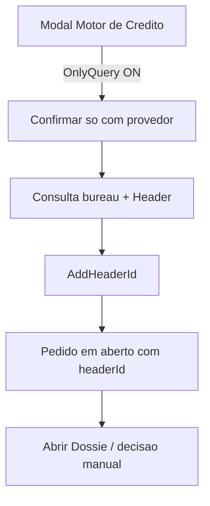

# Análise de Crédito

Pedido formal de avaliação de crédito na plataforma Letmesee.

## Agregado

`AnalysisRequest` — [[Credit Analytics]]

## Fluxos

### Com motor de decisão (padrão)

1. Operador solicita análise no LMS
2. Modal **Motor de crédito**: seleciona provedor + política
3. `POST /api/CreditEngine/process-engine` (`OnlyQuery=false`)
4. Consulta bureau → cria `Header` → amarra `header_id` ao pedido
5. Roda o motor (`ProcessCNPJ` / `ProcessCPF`) → seta `Approved`, `ProcessFinishedAt`, `CreditEngineRequests`
6. Pedido pode ir para histórico processado; dossiê do motor disponível

### Apenas consultar (sem motor)

Permite decisão **manual** com relatório do bureau, sem política e sem motor:

1. Operador abre o modal **Motor de crédito** e ativa **"Apenas consultar (sem motor de decisão)"**
2. Seleciona apenas o provedor (política fica oculta)
3. `POST /api/CreditEngine/process-engine` com `OnlyQuery=true`
4. Consulta bureau → cria `Header` → amarra `header_id` ao pedido
5. **Não** roda o motor: não seta `ProcessFinishedAt` / `Approved` / `AutomaticallyResolved`
6. Pedido permanece **em aberto**; **"Abrir Dossiê"** fica habilitado quando `headerId != null`
7. Operador decide manualmente (aprovar/recusar) após analisar o relatório

## Relacionado

- [[Credit Analytics]]
- [[Motor de Crédito]]
- [[Letmesee]]
- AI Doc Analysis API
