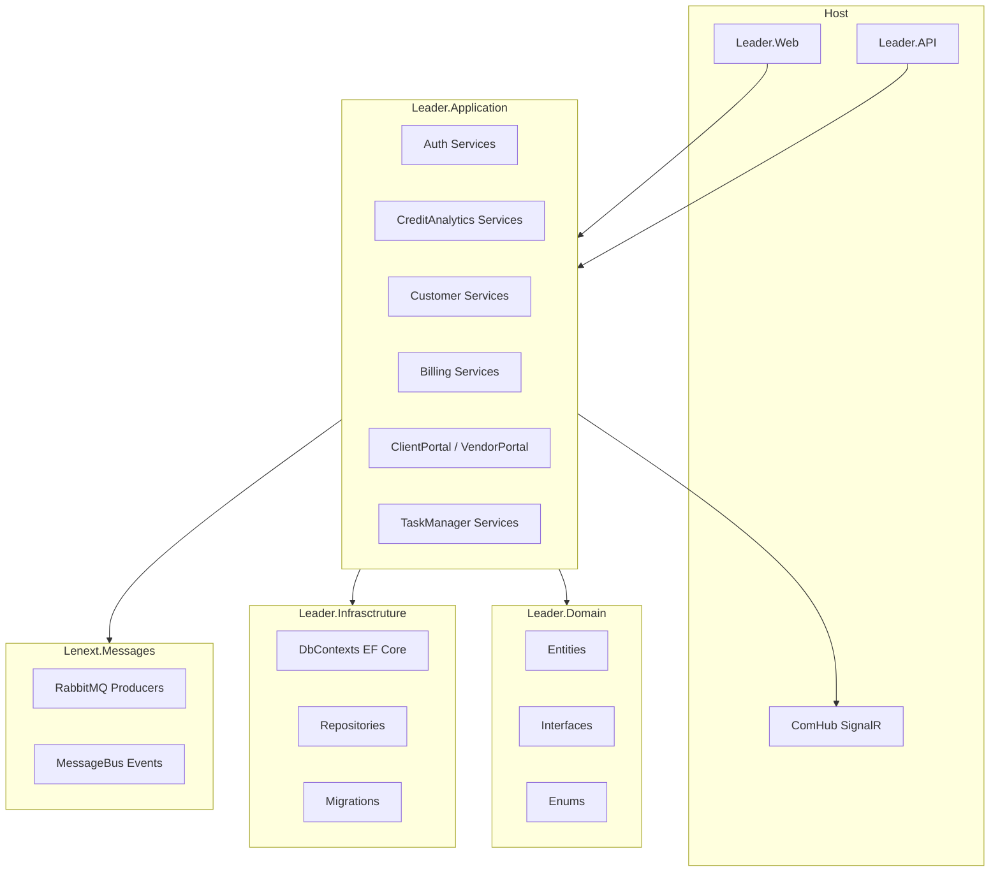
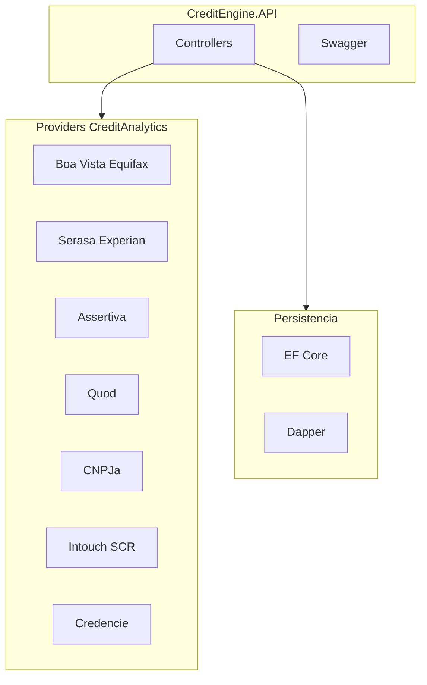
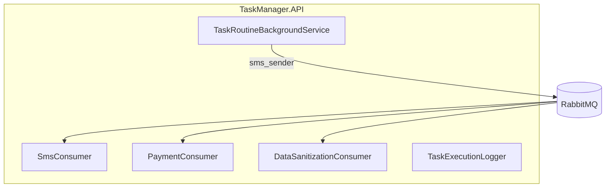

---
title: Componentes C4
tags: [architecture, c4, components]
last_reviewed: 2026-06-28
aliases: [Componentes C4]
---

# C4 Level 3 — Componentes

Módulos internos dos containers principais: [[Letmesee]] e [[Motor de Crédito]].

## Letmesee — camadas Clean Architecture

### Controllers principais (Leader.Web)

| Área | Controllers | Bounded context |
|------|-------------|-----------------|
| Auth | Auth, Account, Manager | [[Identity and Access]] |
| Crédito | CreditAnalytics, CreditEngine, Condition | [[Credit Analytics]] |
| Clientes | Customer, CustomerInvoice | [[Customer]] |
| Cobrança | DefaultingCustomer, BillingQueue | [[Defaulting Collections]] |
| Localização | Localization, DataSanitization | [[Localization]] |
| ERP | Plans, Product, Subscriptions | [[ERP Billing]] |
| Banking | BankingController | [[Banking]] |
| Portais | ClientPortal, VendorPortal | [[Client Portal]], [[Vendor Portal]] |

### DbContexts (database-per-context)

Ver [docs/domain/](../domain/Domain Index.md) e [[SQL Server]].

## Credit Engine — providers

## TaskManager — componentes

## Relacionado

- [[Containers C4]]
- Domínio: [docs/domain/](../domain/Domain Index.md)
