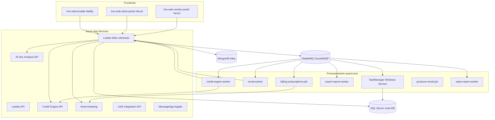

---
title: Containers C4
tags: [architecture, c4, containers]
last_reviewed: 2026-06-28
aliases: [Containers C4]
---

# C4 Level 2 — Containers

Deployáveis do ecossistema Lenext e suas comunicações.

## Diagrama de containers

## APIs e backends

| Container | Tecnologia | Deploy | Documentação |
|-----------|------------|--------|--------------|
| [[Letmesee]] Leader.Web | .NET 8 | Azure App Service | [services/letmesee](../../services/letmesee/Letmesee.md) |
| Leader.API | .NET 8 | Azure | Swagger v1 estático |
| [[Motor de Crédito]] | .NET 8 | Azure | [services/credit-engine](../../services/credit-engine/Credit Engine.md) |
| AI Doc Analysis | .NET 8 | Azure | [services/letmesee-ai-doc-analysis-api](../../services/letmesee-ai-doc-analysis-api/AI Doc Analysis API.md) |
| [[Lenext Banking]] | .NET | Azure | [services/lenext-banking](../../services/lenext-banking/Lenext Banking Service.md) |
| LMS Integration API | .NET | Azure | [services/lms-integration-api](../../services/lms-integration-api/LMS Integration API.md) |
| [[TaskManager]] | .NET 8 | Windows Service | [services/task-manager](../../services/task-manager/TaskManager.md) |
| MessageApp | .NET | Azure | Legado |

## Frontends

| Container | Stack | Deploy |
|-----------|-------|--------|
| LMS Web | React 18, Vite | Netlify |
| Portal Cliente | React 19, Vite | Vercel |
| Portal Comercial | React 19, Vite, PWA | Vercel |

## Workers e jobs

Ver índice em [[Services Index]].

## Filas RabbitMQ

| Fila | Producer | Consumer |
|------|----------|----------|
| `sms_sender` | Letmesee, TaskManager | TaskManager |
| `email_sender` | Letmesee, producer-email-job | email-worker |
| `payment` | Letmesee | TaskManager |
| `data_sanitization` | Letmesee | TaskManager |
| `credit-engine-worker` | Letmesee | credit-engine-worker |
| `analysis_request.processed` | MessageBus | export-report-worker |
| `billing_queue` | billing-job | billing-job |
| `report` | Letmesee | sales-report-worker |

Detalhes: [docs/events/](../events/Events Index.md)

## Datastores

| Store | Uso |
|-------|-----|
| [[SQL Server]] | 16+ databases por bounded context |
| [[MongoDB]] | Logs de mensagens, auxiliar |

## Relacionado

- [[Contexto C4]]
- [[Componentes C4]]
- [[Deployment Lenext]]

> Conteúdo migrado e expandido a partir de `task-manager/docs/ARCHITECTURE.md`.
