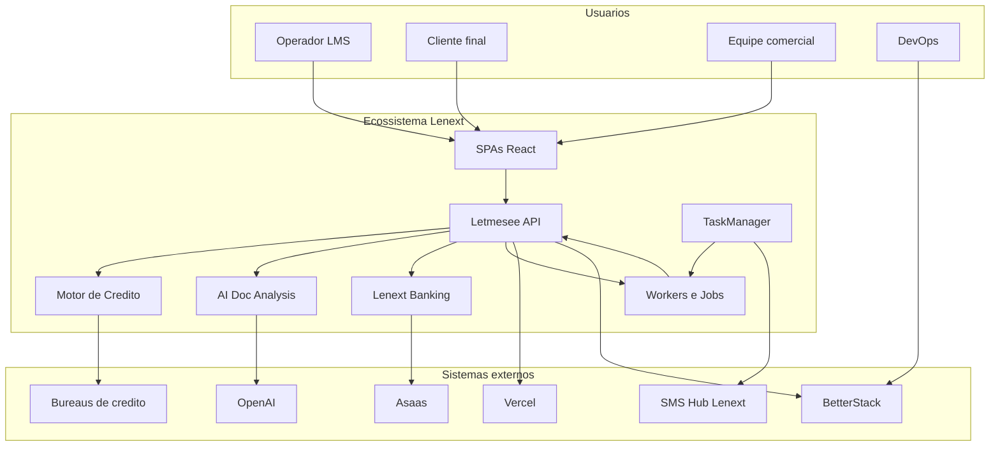

# C4 Level 1 — Contexto do ecossistema Lenext

## Visão geral

O **Lenext / Letmesee** é uma plataforma de gestão de crédito, cobrança e relacionamento com clientes (LMS). O ecossistema combina uma API monolítica central ([[Letmesee]]), microserviços especializados, frontends SPA, processamento assíncrono via [[RabbitMQ]] e integrações com bureaus de crédito e [[Asaas]].

## Objetivo do sistema

Permitir que empresas analisem crédito, gerenciem clientes, inadimplência, cobrança automatizada e portais self-service (cliente e comercial).

## Problema que resolve

- Centralizar análise de crédito multi-bureau
- Automatizar cobrança, SMS, e-mail e pagamentos
- Oferecer portais white-label para clientes finais
- Processar tarefas pesadas de forma assíncrona e resiliente

## Diagrama de contexto

## Atores

| Ator | Interação |
|------|-----------|
| Operador LMS | Usa [[lms-web-lovable]] para operação diária |
| Cliente final | Acessa [[Portal do Cliente]] |
| Equipe comercial | Acessa [[Portal Comercial]] |
| DevOps | Deploy, logs, runbooks |

## Sistemas externos principais

Ver [[Integrações Lenext]].

## Regras de negócio (alto nível)

- Análise de crédito consome créditos do plano do cliente
- Cobrança dispara SMS/e-mail conforme regras configuradas
- Pagamentos via Asaas atualizam faturas e assinaturas
- Portais podem usar domínios customizados via [[Vercel]]

## Riscos e limitações

- Dependência de broker [[RabbitMQ]] (CloudAMQP)
- SQL Server on-premise como datastore principal
- Secrets em appsettings — ver [[ADR-004]]

## Relacionado

- [[Containers C4]]
- [[Deployment Lenext]]
- [[Glossário Lenext]]
