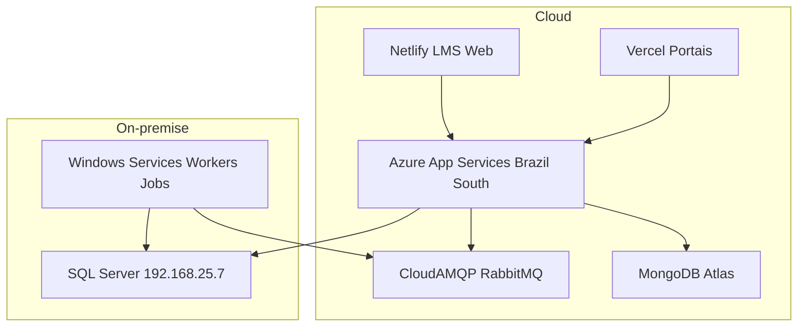

# Deployment e ambientes

## Topologia de deploy

## Ambientes

| Ambiente | Backend | Frontends |
|----------|---------|-----------|
| Produção | `production.letmesee.com.br` | Portais Vercel, LMS Netlify |
| Sandbox | `sandbox.letmesee.com.br` | Preview Vercel |
| Desenvolvimento | `localhost:7121` | Vite dev server |

## Padrões por camada

| Camada | Padrão | CI/CD |
|--------|--------|-------|
| APIs .NET | Azure App Service | GitHub Actions `webapps-deploy` |
| Frontends SPA | Vercel / Netlify | Git push → build estático |
| Workers / Jobs | Windows Service win-x64 | Publish profile local + deploy manual |
| Broker | CloudAMQP SaaS | Config por appsettings |
| SQL | On-premise | Migrations EF Core |

## Apps Azure identificados

- `Letmesee` (Leader.Web)
- `lms-credit-engine`
- `letmesee-ai-doc-analysis-api`
- `lenext-banking`
- `MessageApp`

## Proxy frontend

Frontends usam `vercel.json` / `netlify.toml` para proxy `/api/*` → backend produção.

## Real-time

SignalR hub `/com-hub` — [[Letmesee]] + [[lms-web-lovable]].

## Resiliência

- RabbitMQ: filas duráveis, ack manual nos consumers
- Health checks: endpoints por serviço (documentar por deployável)
- Logs centralizados: [[BetterStack]]

## Relacionado

- [[Containers C4]]
- Runbooks: [docs/runbooks/](../runbooks/)
