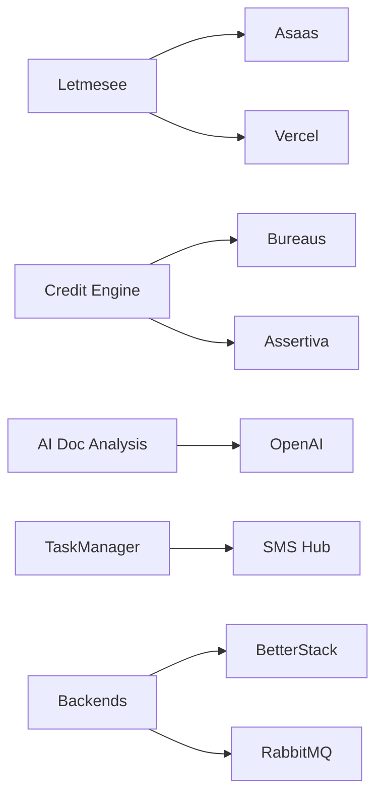

# Integrações externas

Catálogo de sistemas externos consumidos pelo ecossistema Lenext.

## Pagamentos

| Integração | Consumidor | Propósito |
|------------|------------|-----------|
| [[Asaas]] | [[Lenext Banking]], [[Letmesee]], [[TaskManager]] | Boletos, PIX, cartão, webhooks |

## Bureaus e crédito

| Integração | Consumidor | Produtos |
|------------|------------|----------|
| Boa Vista / Equifax | [[Motor de Crédito]] | Define Limite, Define Risco, Acerta |
| Serasa Experian | [[Motor de Crédito]] | Relatórios básico/avancado |
| Assertiva | [[Motor de Crédito]], [[Localization]] | Localização PF/PJ |
| Quod | [[Motor de Crédito]] | Bureau |
| CNPJá | [[Motor de Crédito]] | Dados cadastrais |
| Credencie | [[Motor de Crédito]] | Bureau |
| Intouch / Unitfour | [[Motor de Crédito]] | SCR |

## Infraestrutura e plataforma

| Integração | Consumidor | Propósito |
|------------|------------|-----------|
| [[Vercel]] | [[Letmesee]] ClientPortal | Domínios customizados portais |
| [[BetterStack]] | Backends .NET | Logs Serilog |
| [[RabbitMQ]] CloudAMQP | Todo ecossistema async | Mensageria |
| Firebase | [[lms-web-lovable]] | Auth auxiliar |
| Google Maps | Frontends, Credit Engine | Geolocalização |

## Comunicação

| Integração | Consumidor | Propósito |
|------------|------------|-----------|
| SMS Hub Lenext | [[TaskManager]] | SMS em massa |
| Hostinger SMTP | Workers, backends | E-mail transacional |

## IA

| Integração | Consumidor | Propósito |
|------------|------------|-----------|
| OpenAI | AI Doc Analysis API | Análise documentos, balanço, chamadas |

## Cobrança terceirizada

| Integração | Consumidor | Propósito |
|------------|------------|-----------|
| Leader Empresarial | Letmesee Integration | Devedores, ocorrências |

## Telefonia

| Integração | Consumidor | Propósito |
|------------|------------|-----------|
| Asterisk CDR | [[PABX]] | Gravações |

## Diagrama de integrações

## Roadmap / fora de escopo atual

- Pluggy / Open Finance — não identificado no código
- Stripe — apenas referências visuais de UI

## Relacionado

- [[Contexto C4]]
- Template: [integration-template.md](../../templates/integration-template.md)
