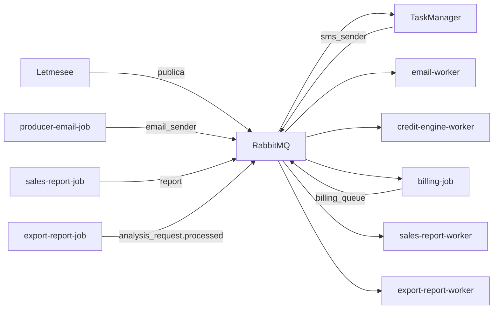

# Eventos e filas RabbitMQ

Catálogo de mensageria do ecossistema Lenext. Broker: [[RabbitMQ]] CloudAMQP.

## Índice de filas

| Fila | Finalidade | Producer | Consumer | Doc |
|------|------------|----------|----------|-----|
| `sms_sender` | SMS em massa — cobrança e notificações | Letmesee, TaskManager | TaskManager | [sms_sender](sms_sender.md) |
| `email_sender` | E-mails de cobrança e notificações | Letmesee, producer-email-job | email-worker | [email_sender](email_sender.md) |
| `payment` | Confirmação de pagamento pós-webhook Asaas | Letmesee | TaskManager | [payment](payment.md) |
| `data_sanitization` | Higienização de base CPF/CNPJ via planilha | Letmesee | TaskManager, MessageApp (legado) | [data_sanitization](data_sanitization.md) |
| `credit-engine-worker` | Consultas assíncronas do motor de crédito | Letmesee | credit-engine-worker | [credit-engine-worker](credit-engine-worker.md) |
| `analysis_request` | Exchange topic — ciclo de vida da análise | MessageBus | — | [analysis_request](analysis_request.md) |
| `analysis_request.processed` | Exportação de relatório pós-análise | MessageBus, export-report-job | export-report-worker | [analysis_request.processed](analysis_request-processed.md) |
| `billing_queue` | Faturamento mensal de assinaturas SaaS | billing-job | billing-job | [billing_queue](billing_queue.md) |
| `report` | Relatórios de vendas agendados | sales-report-job | sales-report-worker | [report](report.md) |
| `invoice_sender` | Faturas de assinatura (**legado**) | TaskManager | — (migrado) | [invoice_sender](invoice_sender.md) |

## Mapa completo

Ver **[[Mapa Lenext]]** — diagramas em camadas (ecossistema, producers/consumers, exchange analysis_request, callbacks HTTP) e matriz de relacionamentos.

## Diagrama resumido

## Padrão técnico

- Biblioteca: `RabbitMQ.Client` (sem MassTransit)
- Producers: `Lenext.Messages` no repositório Letmesee
- Ack manual após processamento bem-sucedido

Ver [[Event Driven Architecture]].
