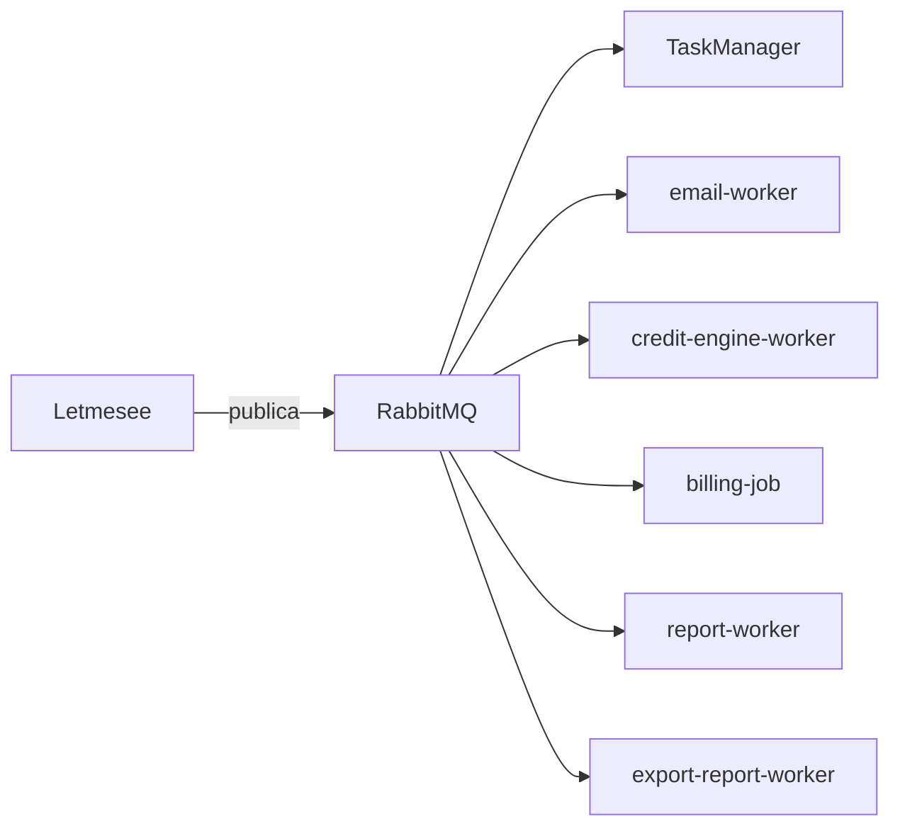

# Eventos e filas RabbitMQ

Catálogo de mensageria do ecossistema Lenext. Broker: [[RabbitMQ]] CloudAMQP.

## Índice de filas

| Fila | Producer | Consumer | Doc |
|------|----------|----------|-----|
| `sms_sender` | Letmesee, TaskManager | TaskManager | [sms_sender](sms_sender.md) |
| `email_sender` | Letmesee, producer-email-job | email-worker | [email_sender](email_sender.md) |
| `payment` | Letmesee | TaskManager | [payment](payment.md) |
| `data_sanitization` | Letmesee | TaskManager | [data_sanitization](data_sanitization.md) |
| `credit-engine-worker` | Letmesee | credit-engine-worker | [credit-engine-worker](credit-engine-worker.md) |
| `analysis_request` | MessageBus | — | [analysis_request](analysis_request.md) |
| `analysis_request.processed` | MessageBus | export-report-worker | [analysis_request.processed](analysis_request-processed.md) |
| `billing_queue` | billing-job | billing-job | [billing_queue](billing_queue.md) |
| `report` | Letmesee | sales-report-worker | [report](report.md) |
| `invoice_sender` | MessageApp legado | MessageApp | [invoice_sender](invoice_sender.md) |

## Diagrama geral

## Padrão técnico

- Biblioteca: `RabbitMQ.Client` (sem MassTransit)
- Producers: `Lenext.Messages` no repositório Letmesee
- Ack manual após processamento bem-sucedido

Ver [[Event Driven Architecture]].
