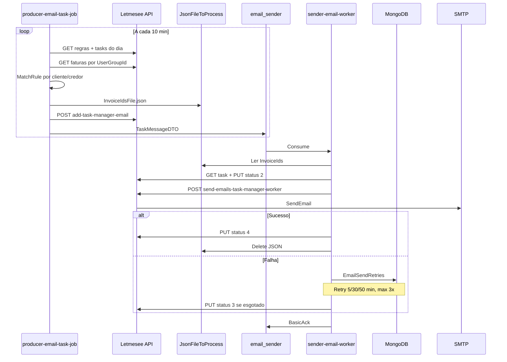

---
title: Evento email_sender
queue: email_sender
tags: [event, rabbitmq]
last_reviewed: 2026-06-28
---

# Evento: `email_sender`

Envio assíncrono de e-mails de cobrança e notificação — pipeline produtor → fila → worker → API Letmesee (SMTP).

## Topologia RabbitMQ

| Item | Valor |
|------|-------|
| **Fila** | `email_sender` |
| **Exchange** | `""` (default/direct) |
| **Routing key** | `email_sender` |
| **Durable** | `true` |
| **Conexão** | CloudAMQP (`MessageSettings:Url`) |

## Producer(s)

| Serviço | Origem |
|---------|--------|
| [Producer Email Job](../../services/letmesee-producer-email-task-job/Producer%20Email%20Job.md) | Job agendado (10 min) — fluxo principal |
| [[Letmesee]] | Disparo manual/automático (legado) |

## Consumer(s)

| Serviço | Papel |
|---------|-------|
| [Email Worker](../../services/letmesee-sender-email-worker/Email%20Worker.md) | Consumer + retry [[MongoDB]] |

## Fluxo completo



## Payload — `TaskMessageDTO`

Publicado pelo producer via `TaskManagerMessageProducerService.SendEmailToImport`:

```json
{
  "TaskId": 12345,
  "User": {
    "UserId": 1,
    "UserGroupId": 10,
    "UserEmail": "usuario@exemplo.com"
  },
  "Rule": {
    "Id": 99,
    "Description": "Cobrança 30 dias",
    "UserGroupId": 10,
    "IdEmailModelTypeBrazilian": 5,
    "Metric": [
      { "MetricType": 1, "MetricValues": [{ "MetricValue": 30 }] }
    ]
  },
  "PathFile": "C:\\Letmesee\\JsonFileToProcess\\2026\\06\\29\\{guid}.json"
}
```

### Arquivo auxiliar — `InvoiceIdsFile`

Gravado em disco pelo producer, lido e deletado pelo worker:

```json
{
  "MessageId": "3fa85f64-5717-4562-b3fc-2c963f66afa6",
  "InvoiceIds": [1001, 1002, 1003]
}
```

Apenas faturas com `DueDate <= hoje` entram no arquivo.

## Etapas resumidas

| # | Etapa | Responsável | O que acontece |
|---|-------|-------------|----------------|
| 1 | Agendamento | Producer | Loop a cada 10 min |
| 2 | Regras | Producer → API | Busca regras + dedup diária |
| 3 | Faturas | Producer → API | Faturas elegíveis por grupo |
| 4 | Matching | Producer | Métricas por cliente/credor |
| 5 | Persistência | Producer | JSON local + task SQL |
| 6 | Publicação | Producer → RMQ | `BasicPublish` |
| 7 | Consumo | Worker | Deserializa + carrega faturas |
| 8 | Envio | Worker → API → SMTP | Templates + e-mail |
| 9 | Retry | Worker → MongoDB | Backoff 5/30/50 min |
| 10 | Status | Worker → API | 2 → 4 (ok) ou 3 (erro) |

## Endpoints Letmesee envolvidos

| Método | Endpoint | Quem chama |
|--------|----------|------------|
| GET | `taskmanager/get-all-user-notification` | Producer |
| GET | `taskmanager/task-manager-email-by-date` | Producer |
| GET | `taskmanager/get-invoices-to-be-send` | Producer |
| POST | `taskmanager/add-task-manager-email` | Producer |
| GET | `taskmanager/get-task-manager-email-by-id` | Worker |
| PUT | `taskmanager/update-task-manager-email` | Worker |
| POST | `taskmanager/send-emails-task-manager-worker` | Worker |

## Processamento downstream (API Letmesee)

1. Busca faturas no SQL Server (`customer.invoices`)
2. Agrupa por comprador, resolve template por país/regra
3. Envia via `_emailService.SendEmail` (SMTP)
4. Grava `EmailSendedHistory` para sucessos
5. Retorna `FailedInvoiceIds` para falhas parciais

## Relacionado

- [[Defaulting Collections]]
- [[RabbitMQ]]
- [[MongoDB]]
- [[Letmesee]]
- [[TaskManager]]
- [Producer Email Job](../../services/letmesee-producer-email-task-job/Producer%20Email%20Job.md)
- [Email Worker](../../services/letmesee-sender-email-worker/Email%20Worker.md)
- [Mapa Mensageria Lenext](../../Mapa%20Lenext.md)
