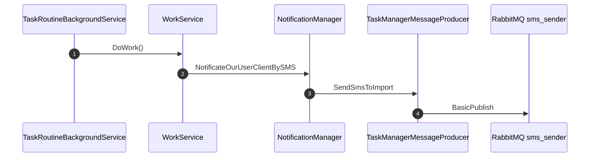
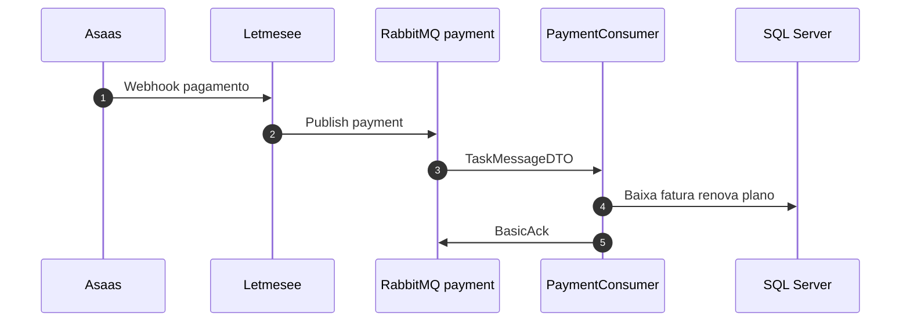

# Fluxos operacionais

Diagramas de sequência dos fluxos assíncronos. Conteúdo migrado de `task-manager/docs/FLOWS.md`.

## Índice

| Fluxo | Fila | Doc |
|-------|------|-----|
| Rotina SMS | `sms_sender` | [sms_sender](sms_sender.md) |
| Consumo SMS | `sms_sender` | abaixo |
| Pagamento Asaas | `payment` | [payment](payment.md) |
| Higienização | `data_sanitization` | [data_sanitization](data_sanitization.md) |
| E-mail | `email_sender` | [email_sender](email_sender.md) |
| Cobrança assinatura | `billing_queue` | [billing_queue](billing_queue.md) |

## Rotina diária SMS

Disparada a cada 20 min por `TaskRoutineBackgroundService`.

## Consumo pagamento

## Cobrança assinatura mensal

Ver [lms-billing-subscriptions-job](../../services/lms-billing-subscriptions-job/Billing Subscriptions Job.md) — scheduler dia 1 → BillingProducer → BillingConsumer.

## Relacionado

- [[TaskManager]]
- [observability](../operations/observability.md)
