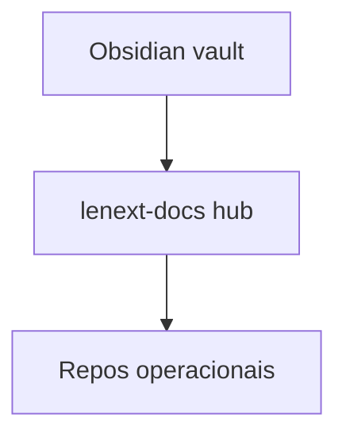

# Onboarding — Arquitetos

## Visão sistêmica

1. [C4 Context](../architecture/context.md) — ecossistema
2. [C4 Containers](../architecture/containers.md) — deployáveis
3. [C4 Components](../architecture/components.md) — Letmesee + Credit Engine
4. [Domínio DDD](../domain/Domain Index.md) — bounded contexts
5. [Eventos](../events/Events Index.md) — RabbitMQ
6. [Integrações](../architecture/integrations.md)
7. [ADRs](../adr/ADR Index.md) — decisões

## Modelo de documentação

- Hub **sintetiza** — repos **detalham** Swagger/deploy
- Conceitos transversais → `concepts/`
- Mudança estrutural → ADR + diagramas C4

## Checklist nova capability

- [ ] Bounded context identificado?
- [ ] Novo container? → `services/` + containers.md
- [ ] Nova fila? → `docs/events/`
- [ ] Breaking change? → ADR
- [ ] Wikilinks bidirecionais

## Relacionado

- [[ADR-000]]
- [[C4 Model]]
