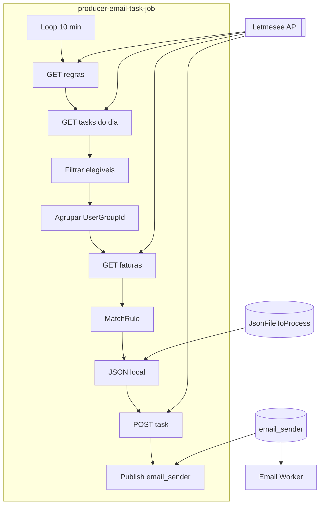

---
title: Producer Email Job
type: job
status: active
repo: letmesee-producer-email-task-job
tags: [service]
last_reviewed: 2026-06-28
---

# letmesee-producer-email-task-job

## Objetivo

Job produtor que identifica **regras de notificação por e-mail** elegíveis, seleciona **faturas inadimplentes** por grupo de usuário e publica tarefas na fila [[RabbitMQ]] `email_sender` para o [Email Worker](../letmesee-sender-email-worker/Email%20Worker.md).

Domínio: [[Defaulting Collections]] — cobrança automática conforme regras configuradas na UI [[TaskManager]].

## Repositório

`c:\Git\Lenext\02-jobs\letmesee-producer-email-task-job`

## Stack

| Camada | Tecnologia |
|--------|------------|
| Runtime | .NET 9 Worker |
| Mensageria | [[RabbitMQ]] (`RabbitMQ.Client`) |
| API | HTTP → [[Letmesee]] |
| Logs | Serilog + BetterStack |
| Deploy | Windows Service |

## Fluxo end-to-end



## Etapas do pipeline

### 1. Agendamento

- **Classe:** `Job` (`BackgroundService`)
- **Intervalo:** 10 minutos (`Task.Delay` no início de cada ciclo)
- **Entry point:** `Program.cs` → `AddHostedService<Job>()`

### 2. Buscar regras

```
GET taskmanager/get-all-user-notification
```

Retorna `RulesOfSendingNotifications` com métricas e modelos de e-mail (PT/ES/EN).

### 3. Deduplicação diária

```
GET taskmanager/task-manager-email-by-date?start=&end=
```

Exclui regras que já geraram task hoje (`RuleId`).

### 4. Filtrar e agrupar

- Só regras com modelo de e-mail configurado
- Agrupadas por `UserGroupId`
- Faturas buscadas **uma vez por grupo**:

```
GET taskmanager/get-invoices-to-be-send?userGroupId=&query=
```

### 5. Matching (`ProcessGroup`)

Regras ordenadas da mais agressiva para a menos (métrica tipo **1** — dias de atraso).

Agrupamento por `(BuyerDocument, CreditorDocument)`.

| MetricType | Significado |
|------------|-------------|
| 1 | Dias de atraso |
| 2 | Status do cliente |
| 3 | Responsável |
| 4 | Billing officer |

| Tipo de regra | Comportamento |
|---------------|---------------|
| Com métrica 1 | Máximo 1 regra (primeira match) |
| Sem métrica 1 | Todas que derem match |

### 6. Publicação (`SendRuleToRabbit`)

1. Grava `{JsonFileToProcess}/{yyyy/MM/dd}/{guid}.json` com `InvoiceIds` (faturas vencidas)
2. `POST taskmanager/add-task-manager-email` → `TaskId`
3. `BasicPublish` → fila `email_sender`

## Payload

Ver contrato completo em [email_sender](../../docs/events/email_sender.md).

## Fila publicada

[email_sender](../../docs/events/email_sender.md)

## Consumer

[Email Worker](../letmesee-sender-email-worker/Email%20Worker.md)

## Configuração

| Chave | Descrição |
|-------|-----------|
| `Environment:JsonFileToProcess` | Pasta JSON compartilhada com o worker |
| `LetmeseeApi:Url` | Base URL API |
| `MessageSettings:Url` | URI AMQP CloudAMQP |
| `MessageSettings:QueueEmail` | `email_sender` |

## Relacionado

- [[RabbitMQ]]
- [[Letmesee]]
- [[TaskManager]]
- [[MongoDB]]
- [Email Worker](../letmesee-sender-email-worker/Email%20Worker.md)
- [Mapa Mensageria Lenext](../../Mapa%20Lenext.md)
