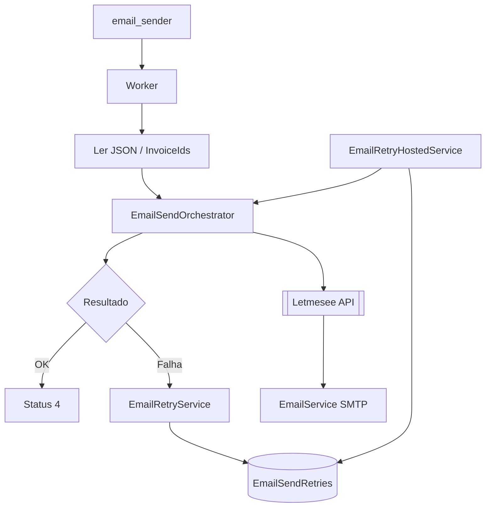

# letmesee-sender-email-worker

## Objetivo

Consome fila `email_sender`, orquestra envio de e-mails de cobrança via API [[Letmesee]] (SMTP) e gerencia retentativas em [[MongoDB]] (`EmailSendRetries`).

O worker **não envia e-mail diretamente** — delega SMTP à API Letmesee (`send-emails-task-manager-worker`).

## Repositório

`c:\Git\Lenext\03-workers\letmesee-sender-email-worker`

## Stack

| Camada | Tecnologia |
|--------|------------|
| Runtime | .NET 9 Worker (2 hosted services) |
| Mensageria | [[RabbitMQ]] consumer |
| Retry | [[MongoDB]] `EmailSendRetries` |
| API | HTTP → [[Letmesee]] |
| Deploy | Windows Service |

## Hosted services

| Serviço | Arquivo | Papel |
|---------|---------|-------|
| `Worker` | `Worker.cs` | Consumer RabbitMQ |
| `EmailRetryHostedService` | `EmailRetryHostedService.cs` | Poll retentativas (30s) |

## Fluxo end-to-end

## Etapas do pipeline

### 1. Consumo (`Worker`)

- Deserializa `TaskMessageDTO`
- Carrega faturas de `PathFile` ou `InvoicesToSend`
- `BasicAck` sempre — durabilidade via MongoDB

### 2. Orquestração (`EmailSendOrchestrator`)

| Passo | Endpoint | Status |
|-------|----------|--------|
| Buscar task | `GET get-task-manager-email-by-id` | — |
| Em processamento | `PUT update-task-manager-email` | **2** |
| Enviar e-mails | `POST send-emails-task-manager-worker` | — |
| Sucesso | `PUT update-task-manager-email` | **4** |
| Esgotou retries | `PUT update-task-manager-email` | **3** |

### 3. Resultado

| Cenário | Ação |
|---------|------|
| Sucesso total | Status 4, deleta JSON local |
| Falha parcial | Retry só `FailedInvoiceIds` |
| Falha total | Retry todas as faturas |

Sucessos parciais gravados imediatamente em `EmailSendedHistory` (SQL via API).

### 4. Retentativa

| Evento | Espera |
|--------|--------|
| Falha inicial | 5 min |
| 1ª retentativa | 30 min |
| 2ª retentativa | 50 min |
| 3ª retentativa falha | Dead + status 3 |

Poll: **30 segundos**. Máximo **20 jobs** por ciclo.

## Status da task

| ID | Significado |
|----|-------------|
| 2 | Em processamento |
| 3 | Erro (retries esgotados) |
| 4 | Concluído |

## Fila

[email_sender](../../docs/events/email_sender.md)

## Producer

[Producer Email Job](../letmesee-producer-email-task-job/Producer%20Email%20Job.md)

## Configuração

| Chave | Descrição |
|-------|-----------|
| `LetmeseeApi:Url` | Base URL API |
| `MessageSettings:Url` | URI AMQP |
| `MessageSettings:QueueEmail` | `email_sender` |
| `MongoDBSettings:Host` | MongoDB Atlas |
| `MongoDBSettings:Name` | `letmesee` |

## Relacionado

- [[MongoDB]]
- [[Letmesee]]
- [[RabbitMQ]]
- [[TaskManager]]
- [[Defaulting Collections]]
- [Producer Email Job](../letmesee-producer-email-task-job/Producer%20Email%20Job.md)
- [Mapa Mensageria Lenext](../../Mapa%20Lenext.md)
