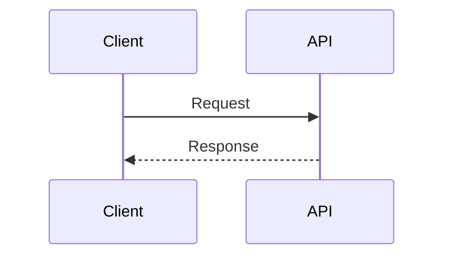

# API: Método /path

## Visão geral

Breve descrição do endpoint.

## Autenticação

- Tipo: JWT Bearer | API Key | Nenhuma
- Permissões: `role:admin`

## Request

### Headers

| Header | Obrigatório | Descrição |
|--------|-------------|-----------|
| Authorization | Sim | Bearer {token} |

### Path parameters

| Parâmetro | Tipo | Descrição |
|-----------|------|-----------|
| id | uuid | |

### Query parameters

| Parâmetro | Tipo | Default | Descrição |
|-----------|------|---------|-----------|
| page | int | 1 | |

### Body

```json
{
  "campo": "valor"
}
```

## Response

### 200 OK

```json
{
  "id": "uuid",
  "campo": "valor"
}
```

### Erros

| Status | Código | Descrição |
|--------|--------|-----------|
| 400 | VALIDATION_ERROR | |
| 401 | UNAUTHORIZED | |
| 404 | NOT_FOUND | |

## Fluxo



## Dependências

- [[Serviço relacionado]]
- Banco: `database_name`

## Swagger

Link para OpenAPI/Swagger no repositório do serviço.

## Exemplos

```bash
curl -X GET "https://production.letmesee.com.br/api/v1/recurso" \
  -H "Authorization: Bearer $TOKEN"
```

## Versionamento

- v1: versão atual
- Breaking changes → nova versão ou ADR
