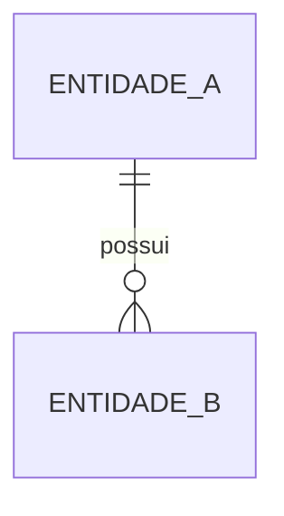

# Database: `nome`

## Visão geral

Bounded context e responsabilidade deste banco.

## DbContext

- Classe: `NomeDbContext`
- Projeto: `Leader.Infrasctruture`
- Migrations: `Migrations/NomeDb/`

## Entidades principais

| Entidade | Tabela | Descrição |
|----------|--------|-----------|
| | | |

## Relacionamentos

## Índices

| Tabela | Índice | Colunas | Motivo |
|--------|--------|---------|--------|
| | | | |

## Constraints

| Tabela | Constraint | Tipo |
|--------|------------|------|
| | | FK / UNIQUE |

## Estratégia de migrações

- EF Core Migrations
- Naming: `YYYYMMDDHHMMSS_Descricao`
- Deploy: script gerado + review

## Connection string

Variável: `ConnectionStrings:NomeDb` (sem expor valor — ver [[ADR-004]])

## Serviços que acessam

| Serviço | Leitura | Escrita |
|---------|---------|---------|
| [[Letmesee]] | Sim | Sim |

## Relacionado

- [[SQL Server]]
- Domínio: [[Bounded Context]]
