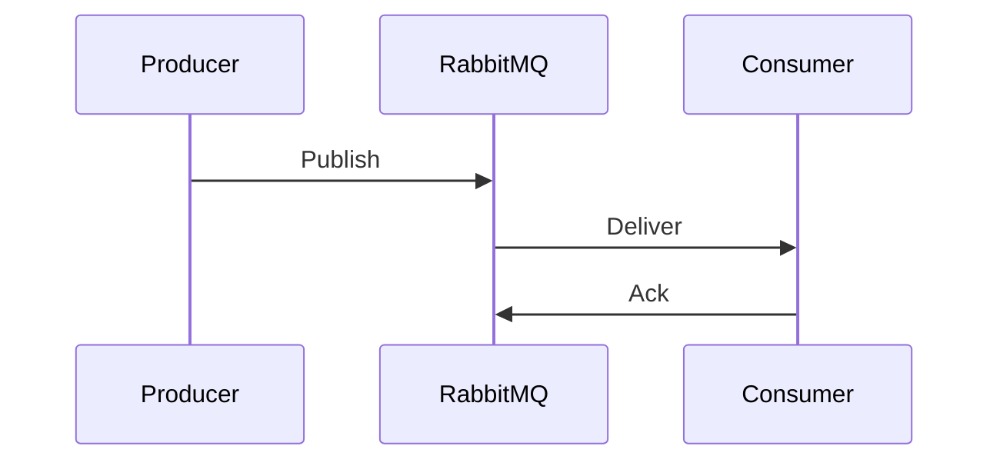

# Evento: `nome_da_fila`

## Visão geral

Descrição do propósito desta mensagem/fila.

## Producer(s)

| Serviço | Classe/Método | Repositório |
|---------|---------------|-------------|
| [[Letmesee]] | `ProducerClass` | `Lenext.Messages` |

## Consumer(s)

| Serviço | Classe | Status |
|---------|--------|--------|
| [[TaskManager]] | `ConsumerClass` | Ativo |

## Payload

```json
{
  "taskId": 0,
  "userGroupId": 0
}
```

| Campo | Tipo | Obrigatório | Descrição |
|-------|------|-------------|-----------|
| taskId | int | Sim | |

## Garantias de entrega

- At-least-once | At-most-once | Exactly-once
- Ack manual após processamento

## Idempotência

Como o consumer trata mensagens duplicadas?

## Retry

| Tentativa | Backoff | Ação |
|-----------|---------|------|
| 1-3 | exponencial | Requeue |
| >3 | — | DLQ |

## DLQ (Dead Letter Queue)

- Nome:
- Monitoramento:

## Diagrama de sequência



## Relacionado

- [[RabbitMQ]]
- Runbook: [docs/runbooks/](../docs/runbooks/)
