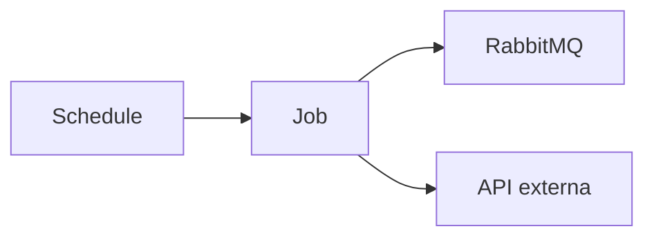

# Job: Nome

> Extensão do [service-template](service-template.md) para jobs agendados ou batch.

## Objetivo

-

## Stack

| Camada | Tecnologia |
|--------|------------|
| Runtime | .NET 9 |
| Scheduling | Windows Task Scheduler / HostedService |
| Deploy | Windows Service |

## Trigger / Schedule

| Tipo | Configuração |
|------|--------------|
| Cron | `0 0 1 * *` (exemplo) |
| Intervalo | |

## Filas publicadas

| Fila | Payload resumido |
|------|------------------|
| | |

## Filas consumidas

| Fila | Consumer interno |
|------|------------------|
| | |

## Fluxo

## Dependências

| Sistema | Uso |
|---------|-----|
| [[Lenext Banking]] | |
| [[Letmesee]] | |

## Idempotência

Como evita execução duplicada no mesmo período?

## Observabilidade

-

## Deploy

-

## Relacionado

- [[RabbitMQ]]
- Runbook: 
